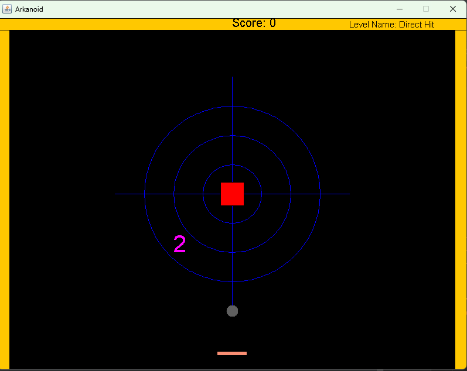
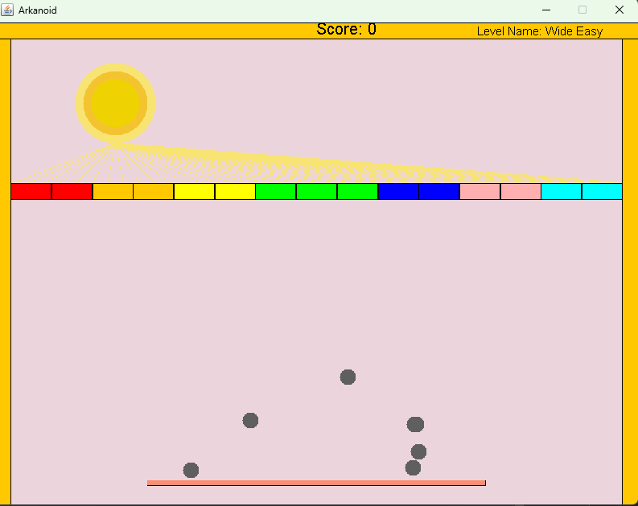
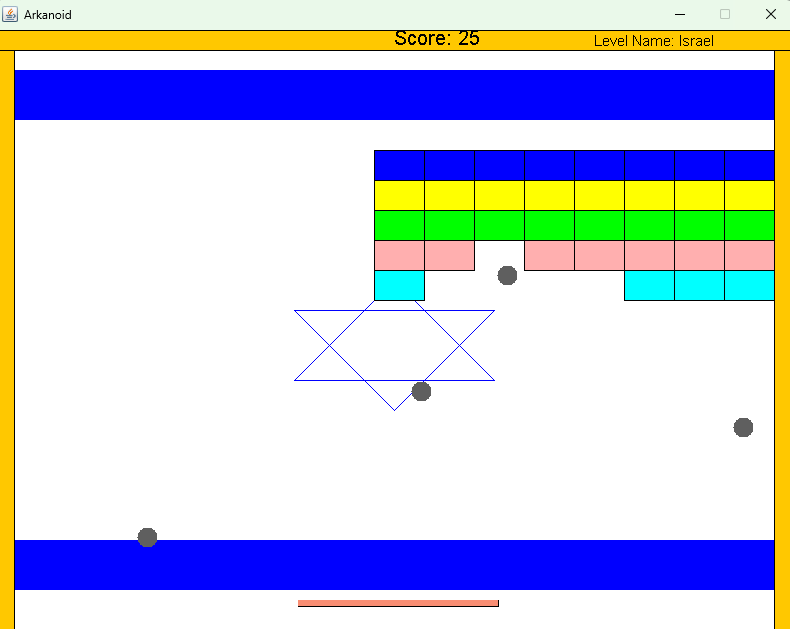
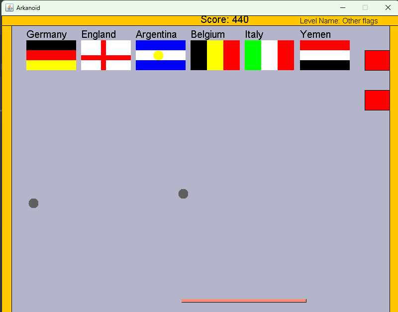
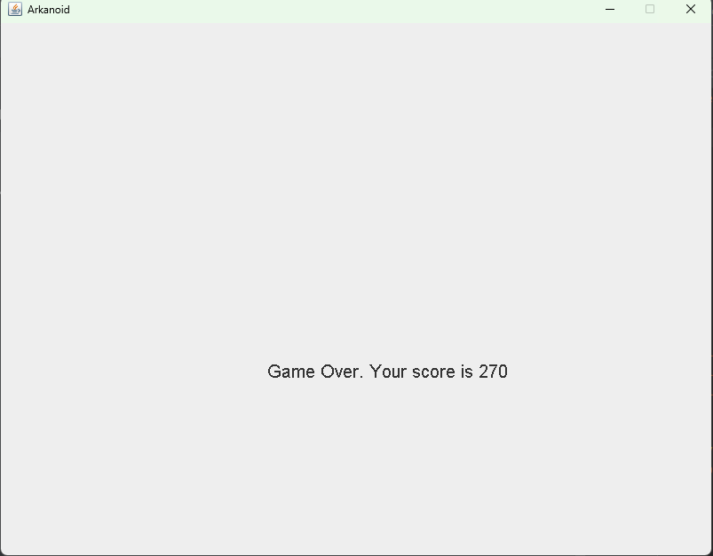
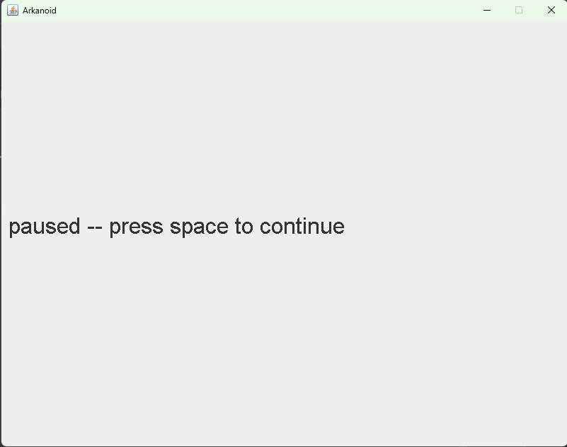

# Arkanoid - block breaker 


## General Information

An implementation of the nostalgic Arkanoid brick breaker game using Java. <br>
Arkanoid is a classic brick-breaking game where the player controls a paddle to deflect a ball against a wall of bricks.<br>
The goal of the game is to clear all of the bricks by breaking them.
The player can lose the game by letting the ball fall below the bottom of the screen.

This Arkanoid version is the final product of Java OOP course, which I took in the 2nd semester of my 1st year at Bar Ilan University.
This project was coded as a five-part ongoing assignment.
Instead of using Java GUI Built-In objects, I used a GUI implementation which is included in this repository.

The implementation includes:

* Polymorphism and inheritance.

* Usage of OOP design patterns, such as Decorator, Observer, Builder, etc.

* Usage of several generic collections data structures such as Linked Lists, Maps, etc.

* User-friendly GUI platform.


## Features
- Supports multiple levels
- Interactive Gameplay
- timer before every level
- Score Tracking
- Responsive Controls
- Pause and Resume
- Game Over and Victory Screens
## how to play 
* Use the arrow keys to move the paddle.
 * Press 'P' to pause the game and space bar to resume it.
## Setup
### Option 1 without Ant
1. Clone the repository:
```
https://github.com/EtaiWil/Arkanoid.git
```

2. Open the project from an IDE .
3. Make sure an updated JDK is set in the configuration, and the src folder of Arkanoid is set as the source root.
4. Create a configuration with Ass6.java as the Main Class, run it, and enjoy!

### Option 2 - With Ant
1. Clone the repository:
  ```
https://github.com/EtaiWil/Arkanoid.git
```
2. Install [Apache Ant](https://ant.apache.org/bindownload.cgi)

   if you're having difficulties with the Ant installation proccess, you can click [here](https://www.youtube.com/watchv=3eaW81yYIqY&t=353s&ab_channel=xscourse) for help.

<br /> 

3. Open CMD in the cloned directory and run this command:
    ```
    ant run
    ```
4. if you want to run specipic level you can run the command ant run ``` -Dargs="<number>"  ``` for example  ``` ant run -Dargs="1 " ```

### Screenshots
####level 1

####level 2

####level 3

####level 4

#### Game over

#### Pause

#### Win Screen


## Built With

- Java


## Author

**Etai Wilentzik**

- [Profile](https://github.com/EtaiWil )
- [Email](mailto:etaiwil2000@gmail.com?subject=Hi "Hi!")
- [LinkedIn](https://www.linkedin.com/in/etai-wilentzik-b5a106212/ "Welcome")

## Support 🤝

Contributions, issues, and feature requests are welcome!

Give a ⭐️ if you like this project!